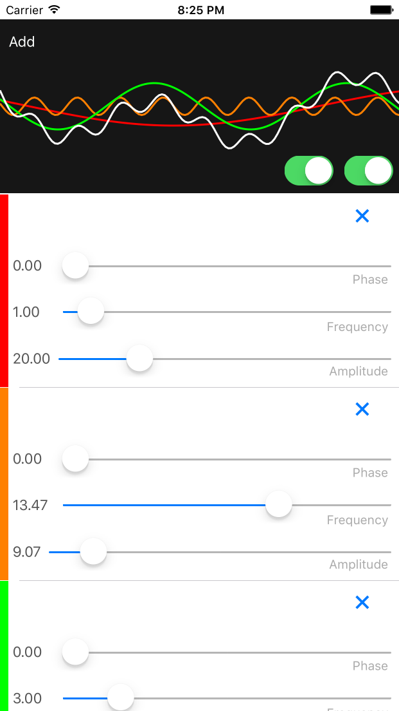

# Sine-Wave

This app draws Sine waves. It keeps a list of sine waves to draw, and allows the amplitude and frequency to be set for each. Each sine wave is shown as a colored line. A white line shows a composite wave made of all of the sine waves. 

The app makes use of Core Graphics to draw sine waves. The SineWaveView class extends UIView. This class draws each sine wave into a single UIBezierPath, and then strokes that path. 

SineWaves are stored in a singleton: SineStore. A tableview with a custom cell displays an interface for each sine wave. 
WaveManager acts Data Source for this tableview. 

## Notes

The controls for each sine wave consist of sliders for amplitude and frequency. There is also a slider for phase.

The Add button in the upper left adds a new sine wave to the view. The first switch in the lower right of the sine wave view hides the composite wave. The second switch aanimates the sine waves. 

Drawing is accomplished by drawing 200 straight line segments tracing the sine across the width of the screen. This seems to create a good balance for performance. At higher frequencies the waves forms start to look a little jagged. 

